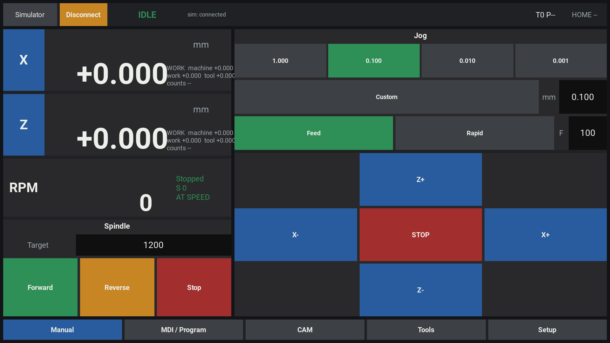
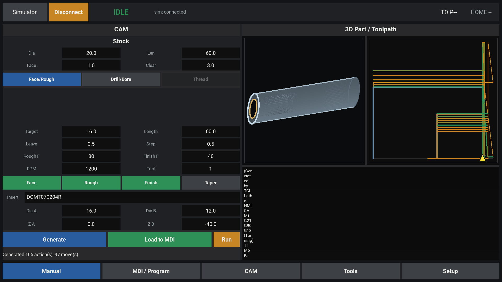
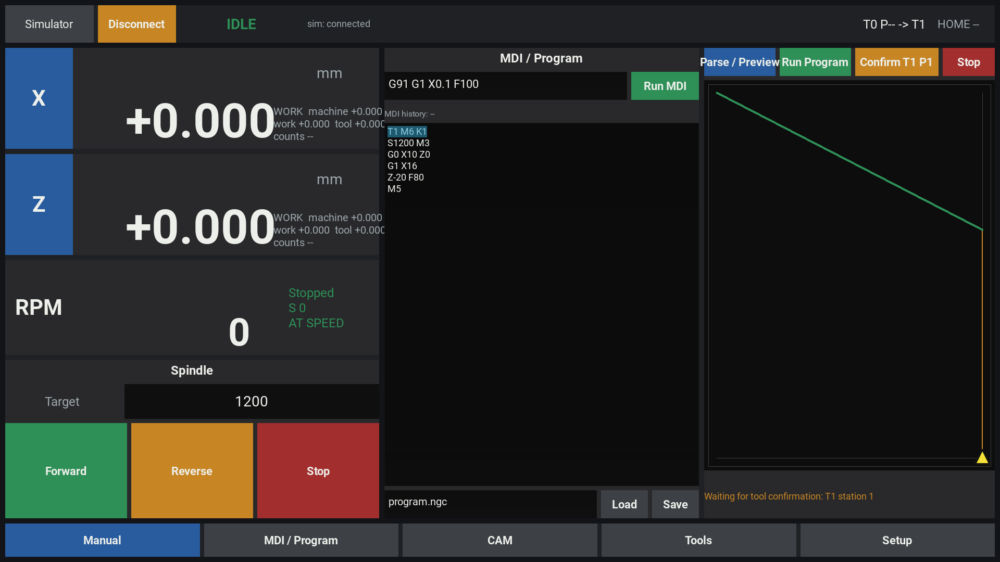

# TCL Lathe HMI

Kivy touchscreen HMI for the TCL lathe, with simulator and FRED USB backends.
The app provides manual machine control, MDI/program execution, tool setup, and
a LibLathe-backed CAM screen for simple turning, facing, drilling, boring, and
taper workflows.

## Screenshots

Manual control:



CAM setup with 3D part overview and 2D toolpath preview:



MDI/program execution with pending tool confirmation and current line highlight:



## Features

- Touch-friendly X/Z DRO using work or machine coordinates.
- Jog controls, configurable increments, feed/rapid jog modes, and spindle
  controls.
- Simulator backend for development without hardware.
- FRED USB backend for real controller communication.
- MDI/program editor with parse/preview, current tool marker, currently
  executing line highlight, and manual pending-tool confirmation.
- Tool table setup and offset management.
- CAM screen with stock, face/rough/finish/taper, drill/bore inputs, 3D part
  sense-check rendering, generated G-code, and direct handoff to MDI.

## Setup

Create or activate a Python environment, then install the HMI dependencies:

```bash
python -m pip install -e .[dev]
```

LibLathe CAM support is vendored as a submodule. After cloning this repo,
initialize the submodules and install LibLathe into the same Python environment
used to run the HMI:

```bash
git submodule update --init --recursive
python -m pip install -e vendor/LibLathe
```

LibLathe builds C++/pybind11 extensions, so the environment needs a C++ compiler
and Python development headers. The CAM screen imports LibLathe lazily; the rest
of the HMI still launches if the editable LibLathe build is not installed.

## Running

Run in simulator mode:

```bash
./run.sh --backend sim
```

Run against FRED USB:

```bash
./run.sh --backend fred
```

The FRED backend imports `fred_client` lazily. By default it looks for the
local client at `../tcl202_dis/rp2040_fred/python` relative to this project.
Set `TCL_LATHE_FRED_PYTHON` to override that path.

## Tests

```bash
python -m pytest
```

## Notes

- CAM-generated programs still execute through the same parser, preview,
  soft-limit checks, spindle actions, and manual tool-change flow as ordinary
  MDI/program input.
- CAM and Setup views use the full main workspace. Manual, MDI/Program, and
  Tools keep the DRO/spindle panel visible.
